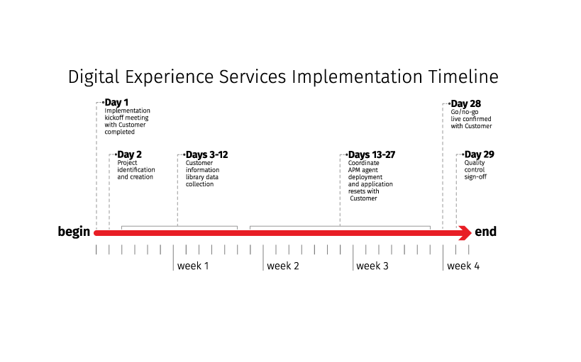

.. _onboarding_timeline.rst:

===================
Onboarding timeline
===================

This section describes the implementation milestones you reach during the
first 30 days of working with the RAS Digital Experience team.

Implementation kickoff meeting completed
^^^^^^^^^^^^^^^^^^^^^^^^^^^^^^^^^^^^^^^^

After the RAS Digital Experience team adds you to Rackspace systems,
you receive a ticket that provides information about your build and
implementation services and a request for times to schedule an implementation
meeting.

When you meet with the RAS Digital Experience team, you discuss your project
and the implementation services your receive.

Project identification and creation
^^^^^^^^^^^^^^^^^^^^^^^^^^^^^^^^^^^

The RAS Digital Experience team uses internal Rackspace project management
tools, as well as our ticketing system to track your implementation. Project
identification and creation is an internal milestone associated with
populating Rackspace product management tools with project tasks.
You don't need to do anything to reach this milestone.

Information library data collection
^^^^^^^^^^^^^^^^^^^^^^^^^^^^^^^^^^^

Your information library data collection is another internal milestone. To
reach this milestone, the RAS Digital Experience team populations an internal
knowledge base with your information, such as account number, escalation
contact information, build information, and so on.

Coordinate APM agent and application resets
^^^^^^^^^^^^^^^^^^^^^^^^^^^^^^^^^^^^^^^^^^^

This milestone consists of the following tickets that require your input:

* **Install agents**: Work with the RAS Digital Experience team to identify the
  devices and applications on which to install data collection agents. It is
  important to ensure that the devices and applications are available and that
  the RAS Digital Experience team has access to them.
* **Define synthetic monitors**: Provide the RAS Digital Experience team
  with detailed steps of the business transactions that you want to monitor.
  For more information about defining synthetic monitors, see
  :ref:`define_monitor`.
* **Configure alerts**: Assist the RAS Digital Experience team in defining
  alerts that fire when specific system events occur.
* **Create a runbook**: A runbook contains procedures that the RAS Digital
  Experience team follows when alerts are triggered. For more information
  about runbooks, see :ref:`write_runbook`.

Go/no-go live confirmed
^^^^^^^^^^^^^^^^^^^^^^^

Before you go live with your application monitoring solution, meet with the
RAS Digital Experience team to verify the launch date, ensure that devices
are monitored, and ensure that alerts are identified and properly configured.

Quality control signoff
^^^^^^^^^^^^^^^^^^^^^^^

The final milestone in the implementation process is a final quality control
step that ensures that all tickets have been completed and closed.
